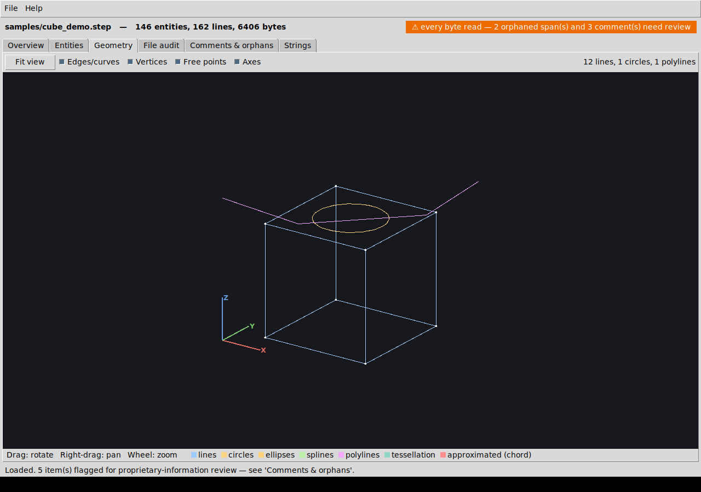
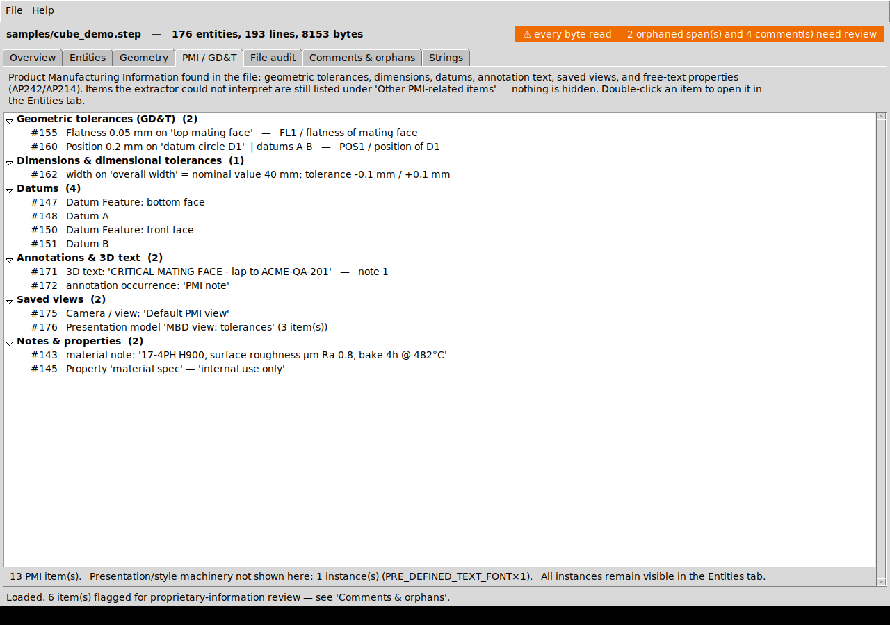
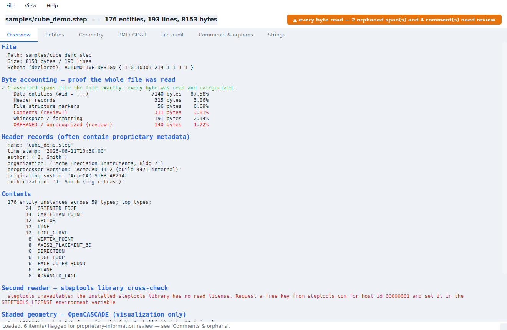
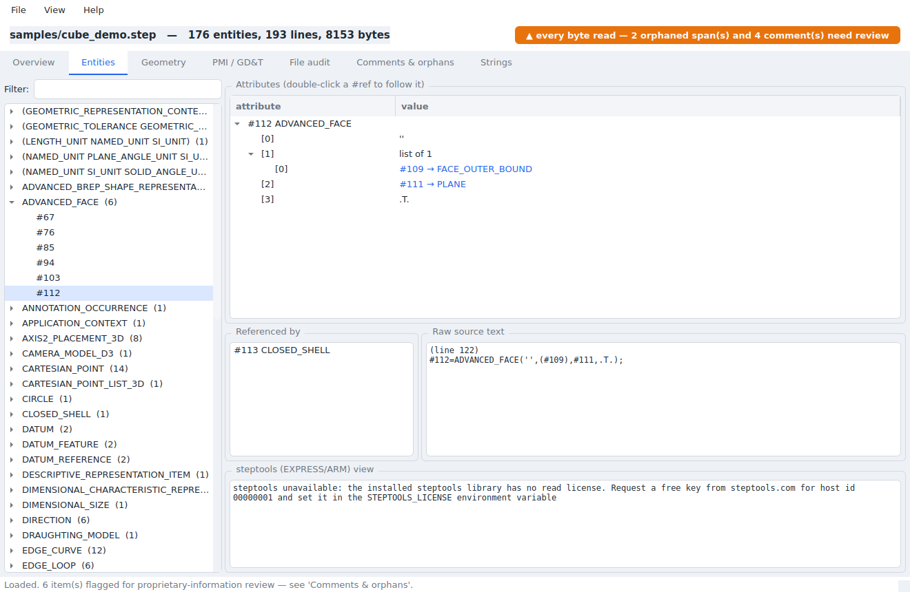
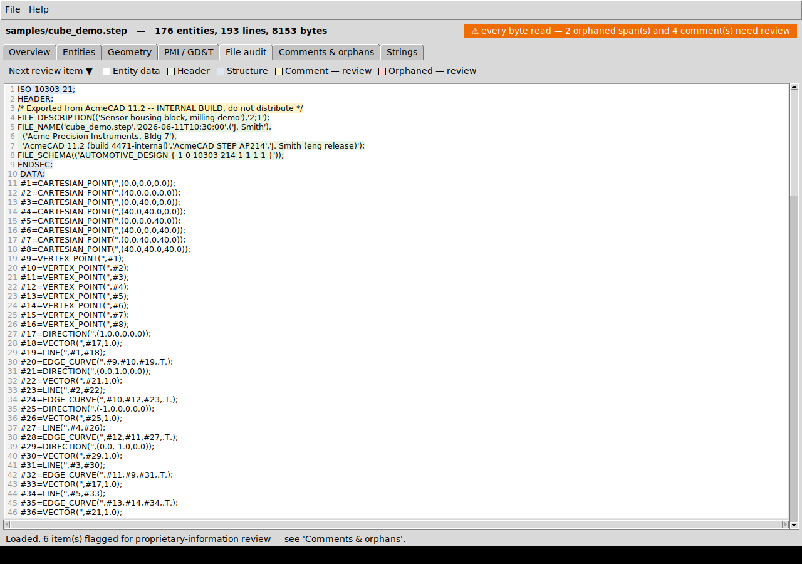
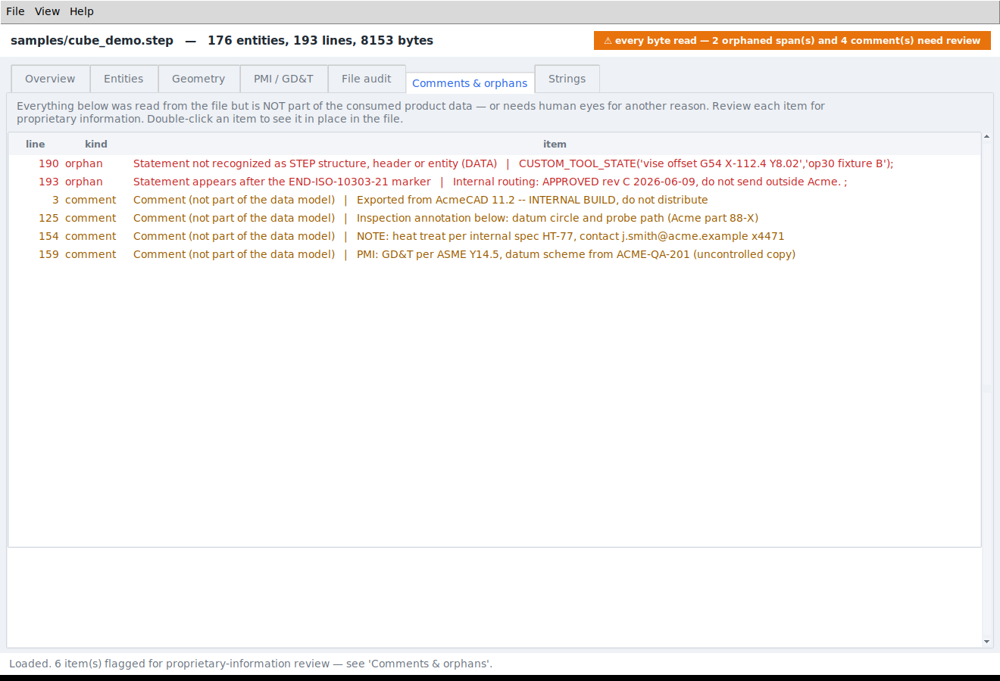
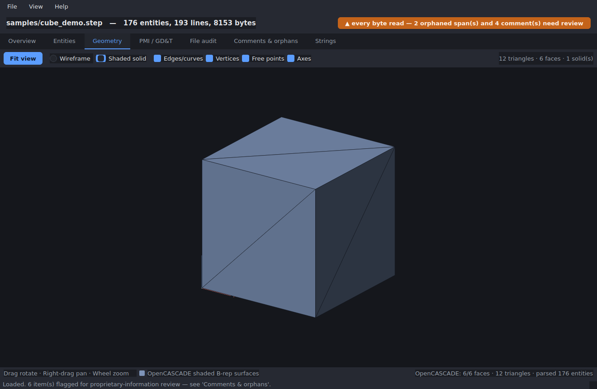
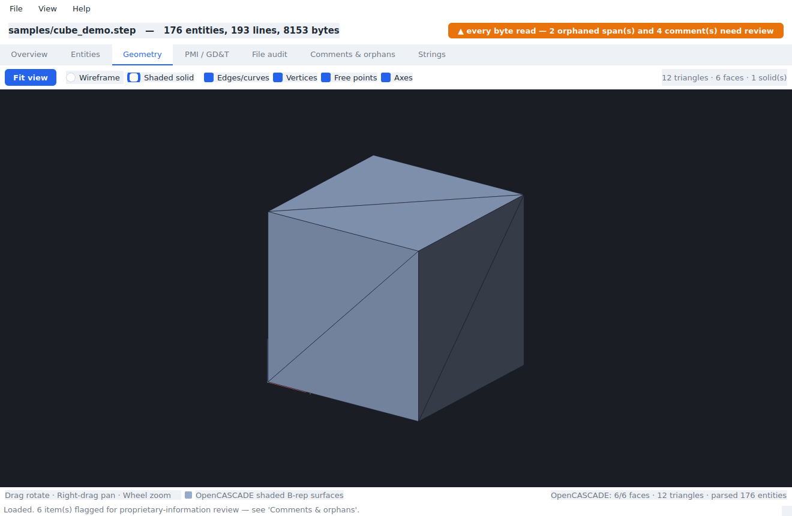
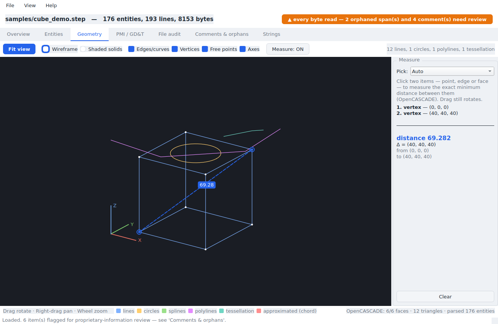
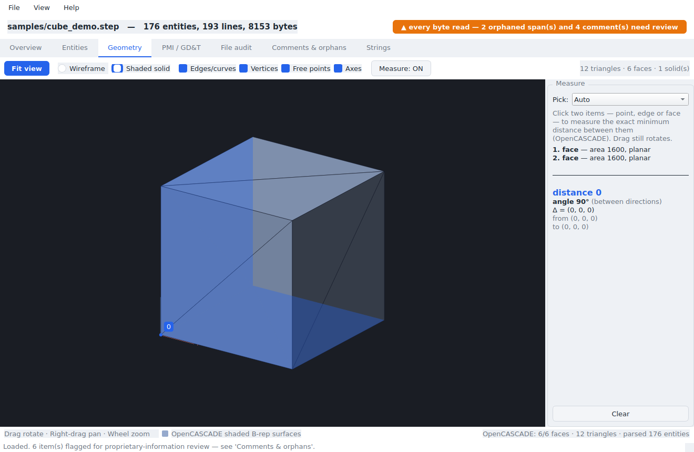

# STEP Inspector

A desktop GUI application for **auditing STEP files (ISO 10303-21, `.step`/`.stp`/`.p21`)
for proprietary information** — without having to read them as raw text.

It shows the geometry, lists every entity and attribute, and — the core
feature — **proves that every byte of the file was read**. Anything that is
*not* consumed into the structured data model (comments, stray text, data
after the end marker, unparseable records) is presented as **orphaned data**
for human review.



## Why

STEP files routinely leave a company's walls — sent to suppliers, customers,
and contract manufacturers. Besides the part geometry they can carry author
names, organization names, internal system identifiers, comments, custom
records, and free-text properties. Reviewing that by eyeballing a text file
is error-prone: it's easy to miss a comment or a non-standard record.

STEP Inspector turns the review into a checklist:

1. **Byte accounting.** The audit parser classifies the file into spans
   (entities, header, structure markers, comments, whitespace, orphaned) and
   verifies the spans **tile the file exactly** — no gaps, no overlaps. The
   green/orange banner tells you at a glance whether everything was read and
   what still needs eyes.
2. **Orphaned data.** Comments, unrecognized statements, text outside
   sections, anything after `END-ISO-10303-21`, unterminated constructs —
   all listed with line numbers and full text.
3. **Everything searchable.** Every entity with parsed attributes, every
   string literal in the file (with `\X2\…` escape sequences decoded),
   header metadata (author, organization, originating system, …).
4. **Second reader.** When available, the file is *also* read with the
   official [`steptools`](https://pypi.org/project/steptools/) library
   (STEP Tools, Inc.) and the two entity sets are cross-checked — extra
   confidence that the audit parser didn't miss an instance.

## AP242, PMI and GD&T

The audit layer is schema-agnostic: any ISO 10303-21 file is fully
byte-accounted regardless of AP (203/214/224/238/242 …), including Part 21
edition-3 constructs (`ANCHOR`/`REFERENCE`/`SIGNATURE` sections are read
and surfaced for review).

For files that carry extra product information — AP242 MBD in particular —
the **PMI / GD&T tab** presents it in readable form:

* **Geometric tolerances** — type (flatness, position, …), magnitude with
  units, the toleranced feature, resolved **datum reference letters**, and
  modifiers; both simple and complex-instance forms are handled.
* **Dimensions** — dimensional size/location with nominal values and
  plus/minus tolerance ranges.
* **Datums** — datum letters, datum features, datum targets.
* **Annotations & 3D text** — `TEXT_LITERAL`/composite text content (where
  free-text PMI notes live), annotation occurrences, draughting callouts.
* **Saved views** — cameras and presentation/draughting models.
* **Notes & properties** — descriptive items, property definitions,
  surface texture.

Consistent with the audit philosophy, the extractor never hides anything:
any PMI-related entity it cannot interpret is listed under **"Other
PMI-related items"** with its text content, flagged for review — and every
instance is always visible in the Entities tab and the triage map.
Tessellated PMI presentation (`TESSELLATED_CURVE_SET` leaders/frames and
triangulated sets) is rendered in the Geometry tab.



## Screenshots

| Overview & coverage proof | Entities browser |
|---|---|
|  |  |

| Color-coded file audit | Comments & orphaned data |
|---|---|
|  |  |

## The tabs

* **Overview** — file metadata, byte-accounting table, header fields
  (name, time stamp, author, organization, preprocessor, originating system,
  authorization), entity inventory, steptools cross-check result.
* **Entities** — all instances grouped by type. Selecting one shows parsed
  attributes (double-click any `#ref` to follow it), reverse references
  ("referenced by"), the raw source text, and the steptools EXPRESS/ARM view.
* **Geometry** — 3D viewer with two render modes (toggle in the toolbar):
  * *Wireframe* (always available, NumPy): B-rep edges (lines, circles,
    ellipses, B-splines, trimmed curves), polylines, tessellated meshes and
    curve sets (AP242 tessellated PMI), vertices and free points. Curves the
    sampler can't evaluate are still drawn as dashed chords and counted —
    nothing is silently dropped.
  * *Shaded solids* (when pythonocc-core is installed): true shaded surface
    triangulation of the exact B-rep via OpenCASCADE — see
    [Shaded surfaces (OpenCASCADE)](#shaded-surfaces-opencascade).

  Drag to rotate, right-drag to pan, wheel to zoom. A **Measure** mode
  reports the exact minimum distance between any two points, edges, or faces
  (see [Measuring distances](#measuring-distances)).
* **PMI / GD&T** — geometric tolerances, dimensions, datums, annotation
  text, saved views, and notes/properties in readable form (see
  [AP242, PMI and GD&T](#ap242-pmi-and-gdt)).
* **File audit** — the complete file with a line-number gutter, colored by
  classification. "Next review item" cycles through comments and orphans.
  Double-click an entity line to open it in the Entities tab.
* **Comments & orphans** — the review queue: every comment, every orphaned
  span, plus warnings (unparseable parameters, dangling references,
  non-standard header records, non-ASCII bytes, …). Double-click jumps to
  the spot in the file.
* **Strings** — every string literal in the file in one searchable table;
  strings whose escape sequences couldn't be fully decoded are flagged with
  their raw form.

`File ▸ Export audit report…` writes the whole audit to a text file:
coverage proof, inventory, review items, orphan text, all strings, and a
**triage map** — one row per classified span showing its byte range,
line number(s), category, identity, and where it was triaged to
(consumed into the data model / header / structure, or *not* consumed and
sent to the review queue). The map ends with a byte total that must equal
the file size, so the report itself is auditable. Omit the map for very
large files with `--no-map` in CLI mode.

## Light & dark themes

The UI ships with a clean light theme (default) and a dark theme; switch at
runtime from **View ▸ Theme**, or start in dark with `--theme dark`. The
layout is identical in both.

| Light | Dark |
|---|---|
|  |  |

## Install & run

Requires Python 3.10+. The GUI is built with **Qt** (PySide6). Runtime
dependencies — **PySide6** (GUI), **NumPy** (geometry math) and
**steptools** (schema recognition + second reader) — are all on PyPI and
installed automatically:

```sh
pip install .
step-inspector path/to/file.step
```

or run from a checkout without installing:

```sh
pip install PySide6 numpy steptools
python -m step_inspector [path/to/file.step]
```

On a headless Linux box Qt needs a few system libs (`libegl1`, `libgl1`,
`libxkbcommon0`); on a normal desktop they are already present.

### Headless report (CI / scripting)

```sh
python -m step_inspector --report file.step > file.audit.txt
```

Exit code is `2` if byte-coverage verification fails, `0` otherwise.

### NumPy and steptools — who does what

The two required libraries are load-bearing, each for what it is good at:

* **NumPy** does the geometry math. Every polyline is an `(N, 3)` array;
  circle/ellipse and B-spline (de Boor) sampling is vectorized, and the 3D
  viewer projects the whole point set with one matrix multiply per frame.
* **steptools** (STEP Tools, Inc.) is the authoritative reader: schema
  recognition, ARM (application model) recognition, header objects, and an
  independent enumeration of every entity instance used to cross-check the
  audit parser. Its read API requires a license key — free keys are issued
  at [steptools.com](https://www.steptools.com/); set the key string in the
  `STEPTOOLS_LICENSE` environment variable.

If no steptools license is present the application is still fully
functional — the audit parser, NumPy geometry, PMI extraction and all review
features are independent of it; only the cross-check panel and the EXPRESS/ARM
entity view report that the second reader is unavailable. Skip it explicitly
with `--no-steptools`.

> Note on STEP Tools and meshing: the `steptools` binary does contain STEP
> Tools' StixMesh B-rep faceter (`stix_mesh_make*`, the `RoseMesh*` classes),
> but those are **C++ entry points not bound in the Python package** — so the
> shaded surface view uses OpenCASCADE instead (below).

## Shaded surfaces (OpenCASCADE)

The wireframe view shows B-rep *edges*. For true shaded *surfaces* — exact
solids tessellated and flat-shaded — STEP Inspector uses **OpenCASCADE** via
the optional `pythonocc-core` package. Switch to it with the *Shaded solids*
toggle on the Geometry tab.

| Wireframe (NumPy) | Shaded solids (OpenCASCADE) |
|---|---|
|  |  |

`pythonocc-core` is a large, conda-only dependency (it is **not** on PyPI):

```sh
conda install -c conda-forge pythonocc-core
```

It is entirely optional: without it, the Geometry tab still works in
wireframe mode and the rest of the app is unaffected (the *Shaded solids*
toggle is simply disabled with a hint).

For a one-command, fully reproducible setup with OpenCASCADE included, use
the bundled conda environment file:

```sh
conda env create -f environment.yml
conda activate step-inspector
python -m step_inspector [file.step]
```

### Mass & size properties

When OpenCASCADE meshes a part it also reports its exact **bounding box**,
**surface area**, and — for closed solids — **volume** and **centre of
mass** (via `BRepGProp` / `Bnd_Box`). These appear in the Overview tab's
OpenCASCADE section and in the `--report --shaded` output, e.g.:

```
  bounding box: 60.2 x 60.2 x 50.2
  volume: 64000   surface area: 9600
  centre of mass: (20, 20, 20)
```

### Coverage is still the audit parser's job — OpenCASCADE is accounted for

OpenCASCADE has its own, *more permissive* STEP reader: it will load a file
and merely print a "Fails Count" for syntax it dislikes. It therefore **must
not** be treated as proof that the whole file was consumed — that guarantee
stays with the byte-tiling audit parser. To keep OCC honest rather than a
black box, STEP Inspector **accounts** for what it did and cross-checks it
against the audit parser. The Overview tab and the (`--shaded`) report show,
for example:

```
SHADED GEOMETRY (OpenCASCADE — visualization only)
  faces meshed: 6/6   solids: 1   shells: 1
  triangles: 12   nodes: 24
  OpenCASCADE reader parsed 176 entities; audit parser found 176 — MATCH
  (Byte-level coverage is proven by the audit parser above; OpenCASCADE only renders surfaces.)
```

Any face OpenCASCADE cannot tessellate, and any disagreement between its
entity count and the audit parser's, is surfaced — never hidden.

### Measuring distances

With OpenCASCADE available, the Geometry tab has a **Measure** mode. Toggle
it on, then click two items — a **point**, an **edge**, or a **face**, in any
combination — and STEP Inspector reports the **exact minimum distance**
between them (computed on the real B-rep with `BRepExtrema_DistShapeShape`,
not estimated from the triangle mesh). The two picked sub-shapes are
highlighted, a connector with the distance label is drawn between the closest
points, and the side panel shows the distance, the ΔX/ΔY/ΔZ vector, both
closest-point coordinates, and each selection's info:

* **points** — coordinates
* **edges** — length; for a circular edge, **radius and diameter**
* **faces** — area; for a cylindrical face, **radius and diameter**

When both selections have a well-defined direction (a straight edge, or a
planar face's normal, or a cylinder axis) the **angle** between them is
reported too — e.g. two adjacent cube faces read distance 0, angle 90°.

| Point-to-point | Face-to-face |
|---|---|
|  |  |

A **Pick** filter (Auto / Points / Edges / Faces) restricts what a click
selects when geometry overlaps. Dragging still rotates the model, so picking
and orbiting coexist. Measurement needs the OpenCASCADE backend; without
pythonocc-core the Measure button is disabled.

## Demo file

`samples/cube_demo.step` (regenerate with `python samples/make_sample.py`)
is a structurally complete AP214 cube that deliberately contains the things
this tool exists to catch: comments with sensitive-looking text, an
`\X2\`-encoded string, free-text properties, a non-standard record inside
`DATA`, and trailing text after the end marker.

## Tests

```sh
python -m unittest discover -s tests -v
```

## Limitations

* The geometry view is a review aid, not a CAD kernel: surfaces are shown by
  their edge wireframes, and assembly placement transforms are not applied
  (each part renders in its local frame).
* Part 21 edition-3 sections (`ANCHOR`/`REFERENCE`/`SIGNATURE`) are read and
  surfaced for review rather than interpreted.

## License

MIT — see [LICENSE](LICENSE). The optional `steptools` library has its own
proprietary license terms.
